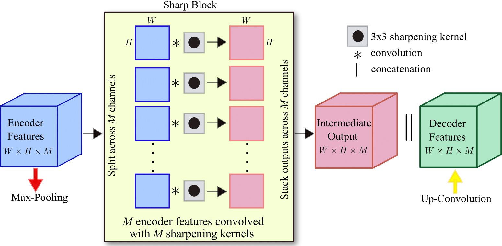
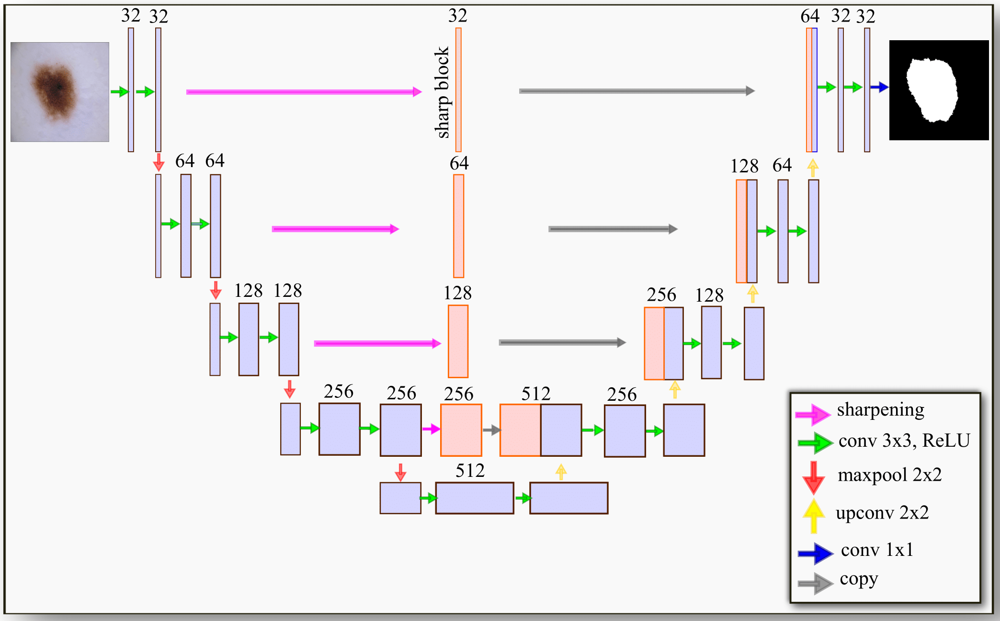

# Sharp U-Net: Depthwise Convolutional Network for Biomedical Image Segmentation


This code is part of the supplementary materials for our paper *Sharp U-Net* published in Computers in Biology and Medicine, 2021.

Sharp U-Net is a new encoder-decoder depthwise fully convolutional network architecture for
binary and multi-class image segmentation. The core idea is to convolve the output of the encoder feature map with a sharpening
spatial kernel/filter, prior to performing fusion with the decoder features in the skip connections.

<p align="center">
  <a href="#"></a> <br />
  <em> 
    Figure 1. Illustration of the proposed Sharp Block.
    </em>
</p>

The proposed segmentation framework is not only able to
make the encoder and decoder features semantically less dissimilar, but also helps smooth out artifacts throughout the network layers during the early stages of training. These additional operations do not increase the number of learnable parameters, and hence no additional computational cost is incurred.

<p align="center">
  <a href="#"></a> <br />
  <em> 
    Figure 2. Schematic layout of the Sharp U-Net architecture.
    </em>
</p>

## Resources
* [Paper](https://www.sciencedirect.com/science/article/abs/pii/S0010482521004935)
* [Preprint](https://arxiv.org/abs/2107.12461)

## Colab Notebook Demo
Model architecture code is available in the demo notebook for binary image segmentation use-case, which runs on Colab! Can be easily adapted for multi-class image segmentation.

## Citation
If you use this code or models in your scientific work, please cite the following paper:

```bibtex
@article{zunair2021sharp,
  title={Sharp U-Net: Depthwise Convolutional Network for Biomedical Image Segmentation},
  author={Zunair, Hasib and Hamza, A Ben},
  journal={Computers in Biology and Medicine},
  pages={104699},
  year={2021},
  publisher={Elsevier}
}
```

## Reference to other models
Model definition scripts are based on [https://github.com/jocicmarko/ultrasound-nerve-segmentation/blob/master/train.py](https://github.com/jocicmarko/ultrasound-nerve-segmentation/blob/master/train.py).

## License
MIT
